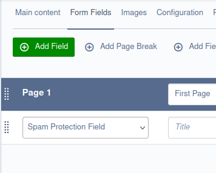

# hCaptcha spam protection

Protect your forms with [hCaptcha](https://www.hcaptcha.com/), a GDPR, CCPA, LGPD, PIPL and more compliant spam prodection
(according their website) 

## Installation

Make sure you met the following requirements beforehand:

- SilverStripe 4.x
- SilverStripe Spam Protection 3.x
- PHP CURL and JSON

```
composer require oposs/silverstripe-hcaptcha
```

And set hCaptcha as your default spamprotector:

```yaml

SilverStripe\SpamProtection\Extension\FormSpamProtectionExtension:
  default_spam_protector: Oposs\hCaptcha\hCaptchaProtector

```

## Configuration

In  your `app/_config/hcaptcha.yml`

```yaml

Oposs\hCaptcha\Forms\hCaptchaField:
  site_key: 'your_site_key'
  # Make sure to set the key starting with 0x.. in quotes
  secret_key: 'your_secret_key'
  # To configure options listed here https://docs.hcaptcha.com/configuration
  api_configuration:
    recaptchacompat: 'off'

```

For more configuration options check comments in [hCaptchaField.php](src/Froms/hCaptchaField.php)

## Usage

In php:

```php

use Oposs\hCaptcha\hCaptchaProtector\Forms

new hCaptchaField('SpamProtection', 'SpamProtection', null);

```

Or if you use [Userforms](https://github.com/silverstripe/silverstripe-userforms):




## Troubleshooting

**Q:** Users are redirected to the main page when the captcha is incorrect or not solved

**A:** This is most likely a redirecting problem, if your site is running behind a proxy have a look at
the Director's `alternate_base_url` property (albeit heavily used, not document yet...)


Contributions are welcome :)
